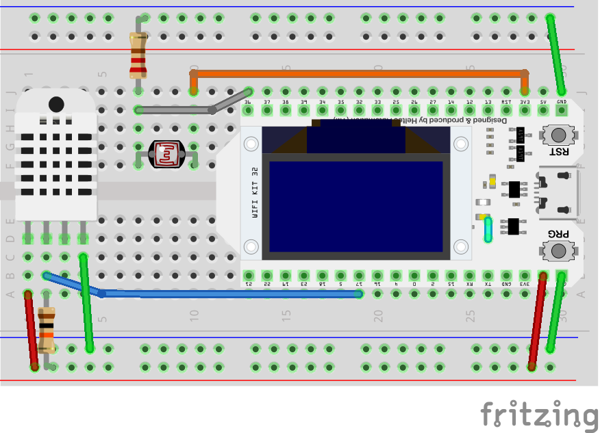

# Basement Monitor: IoT Demo by David Kramer

## Introduction
This code demonstrates gathering data from sensors and publishing the data as messages to an MQTT broker, as well as responding to messages to turn the LED on and off.

In my case, I used [Mosquitto](https://mosquitto.org/) as an MQTT broker, [MQTT Explorer](http://mqtt-explorer.com/) as a desktop MQTT client to show and graph the sensor data, and [MQTT Dash](https://play.google.com/store/apps/details?id=net.routix.mqttdash&hl=en_US&gl=US) as a mobile app demonstration, showing how multiple publishers and subscribers work.

## Hardware
The hardware used in writing it is a [Heltec/Hiletgo SP32 OLED WiFi Kit ESP-32 0.96 Inch Blue OLED Display WIFI Bluetooth CP2012 Internet Dev Board](www.hiletgo.com/ProductDetail/2157143.html), which has an OLED display attached to the top, making it easier to debug and use.

It uses a [DHT22 temperature-humidity sensor ](https://www.adafruit.com/product/385) for temperature and humidity sensing, and [a generic LDR](https://www.adafruit.com/product/161) (light dependent resistor AKA photoresistor AKA photosensor).  

## Messaging
The following MQTT topics are used in the code as is:
- Sent
  - **sensors/basement/connected**: Sent when ESP32 connects to MQTT broker
  - **sensors/basement/temperature_f**: Current temperature in farenheight 
  - **sensors/basement/humidity**: Relative humidity (0-100)
  - **sensors/basement/light**: Current light level (0 - 4096)
- Received
  - **sensors/basement/led**: **1** turns on the LED, anything else turns it off

## Configuration 
Since the **config.h** file has authentication information and specific pin usage, I have saved a starting file as **config_TEMPLATE.h**.  Be sure to rename it to **config.h** after adding your specific values.

## Arduino Libraries
- [PubSubClient](https://www.arduino.cc/reference/en/libraries/pubsubclient/): The MQTT client.
- [TaskManager](https://www.arduino.cc/reference/en/libraries/taskmanager/) A library to run tasks at a specific interval.  For demonstration purposed, the interval of temperature/humidity sensing, light sensing, and polling are all done at different rates.
- [DHTesp](https://www.arduino.cc/reference/en/libraries/dht-sensor-library-for-espx/): A library for the DHT11/DHT22 specifically designed for the ESP8266/ESP32.
- Heltec-specific libraries for WiFi and display.